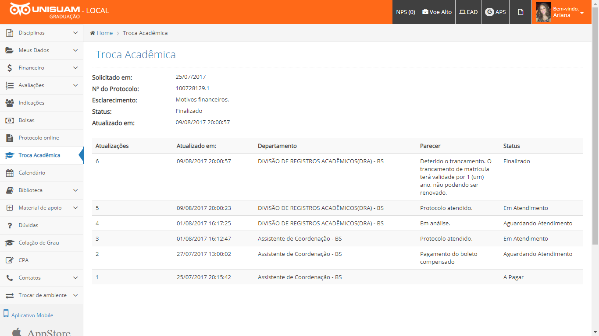
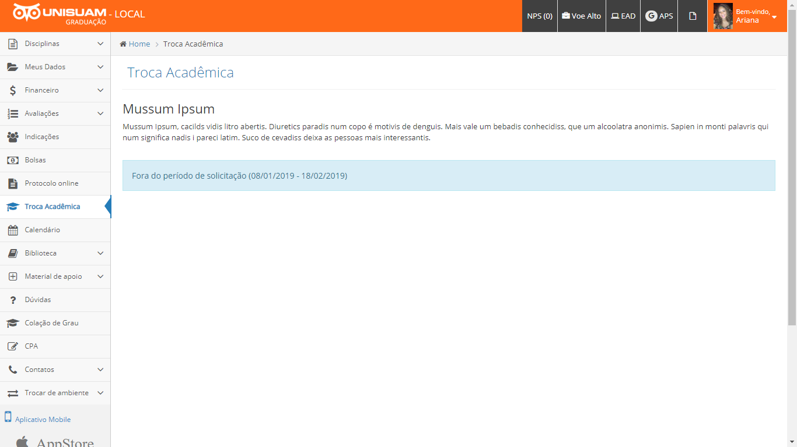
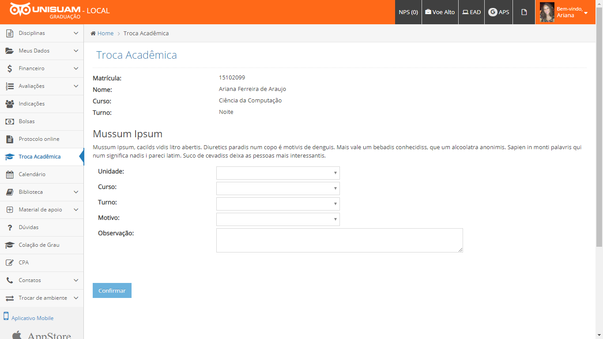
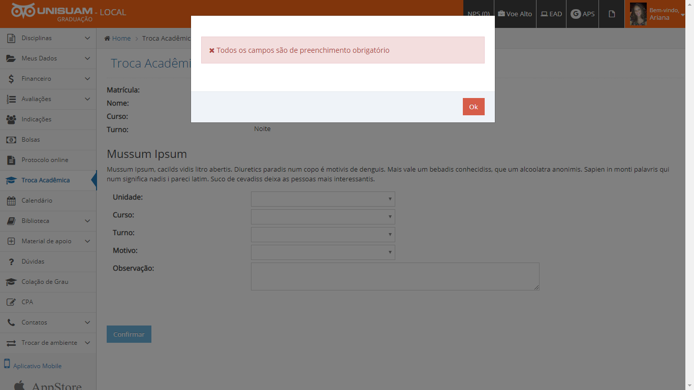

# @Automação Trocas Acadêmicas - Graduação@

### Colaboradores envolvidos
>* Marco Saraiva (*Registros Acadêmicos*)
* Fábio Brito (*Secretaria Geral*)
* Maurício Pacheco (*Marketing*)
* Daniel Rocha (*TI-Desenvolvimento*)

### Objetivo

>Automatizar o processo de trocas acadêmicas, visto que o fluxo atual precisa de interferência de diversos setores (Secretaria Geral, Registro Acadêmico, Bolsas e Ensino). No novo processo, o sistema será configurado para evitar a dependência humana, sendo necessário somente nos casos de exceção.

### Passo 1 - Detalhamento do Pedido em Execução

O sistema verifica a existência de algum pedido de troca acadêmica com status não finalizado. Caso encontre, é exibido os dados do pedido, assim como o histórico de encaminhamentos.

### Passo 2 - Verificação de Bloqueio de Pedidos

O sistema realiza um checklist para saber se o aluno pode realizar a solicitação de troca acadêmica e exibe uma mensagem para cada item não válido.

| Item | Regra | Mensagem |
|---|---|---|
| Prazo do requerimento | O período de início e fim do tipo de requerimento deve estar válido para a data da solicitação | Fora do período de solicitação ([Início] - [Fim]) |
| Renovação judicial sem ônus | O aluno não pode possuir  renovação judicial sem ônus | Aluno com renovação judicial |
| Status do aluno | O aluno deve estar com status matriculado ou pré-inscrito | Status incompatível para solicitação ([Status]) |
| Formato da estrutura | O aluno deve estar em uma estrutura de formato periódico | Formato da estrutura incompatível para solicitação ([Formato]) |

### Passo 3 - Formulário de Solicitação

O sistema exibe as informações atuais do aluno, e permite que o aluno selecione uma das ofertas (unidade/curso/turno) possíveis para realização da troca, assim como o motivo e um texto informativo.

Lorem Ipsum is simply dummy text of the printing and typesetting industry. Lorem Ipsum has been the industry's standard dummy text ever since the 1500s, when an unknown printer took a galley of type and scrambled it to make a type specimen book. It has survived not only five centuries, but also the leap into electronic typesetting, remaining essentially unchanged. It was popularised in the 1960s with the release of Letraset sheets containing Lorem Ipsum passages, and more recently with desktop publishing software like Aldus PageMaker including versions of Lorem Ipsum.

### Passo 4 - Processamento da Solicitação

Lorem Ipsum is simply dummy text of the printing and typesetting industry. Lorem Ipsum has been the industry's standard dummy text ever since the 1500s, when an unknown printer took a galley of type and scrambled it to make a type specimen book. It has survived not only five centuries, but also the leap into electronic typesetting, remaining essentially unchanged. It was popularised in the 1960s with the release of Letraset sheets containing Lorem Ipsum passages, and more recently with desktop publishing software like Aldus PageMaker including versions of Lorem Ipsum.

