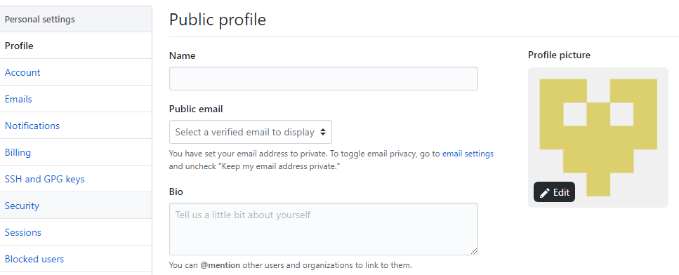
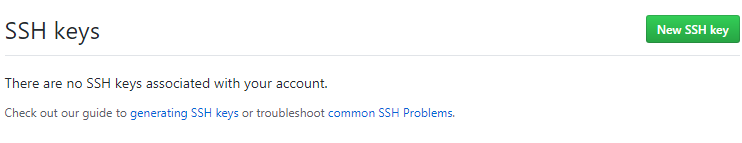
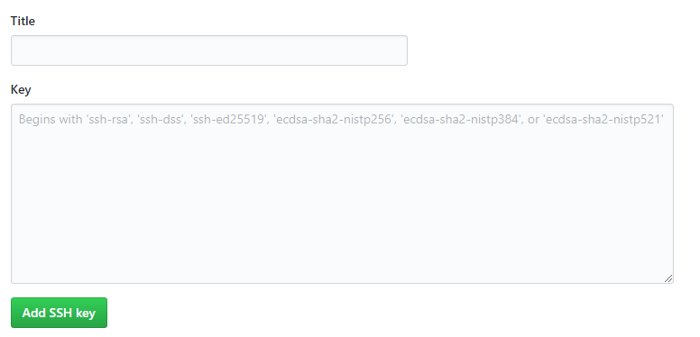

# @Git Hub / Git@

## Instalação

___
### Instalar o Git for Windows NNC (Next, Next, Concluir)
>Git é usado via *CMD* (prompt de Comando) ou *CMDER* (Aplicativo que emula o CMD **Mais interativo**)!__

### Instalar o Git no Linux (```apt-get install git```)

>Configuração na proxima pagina!!

>Documentação de programas para linux e sua configuração [Em breve](Doc_Linux.md)

### Criação de conta no Git ([GitHub](https://github.com/))
>criação seguindo os passos que o site te oferece

### Criação de um SSH chave de acesso

>Serve para manter o contato com do seu repositório local com o online

```shell
ssh-keygen -t rsa -C *Email da sua conta*

```
Após isso será gerada dois arquivos *{id_dsa e o id_dsa.pub}* na pasta padrão **(C:Users/*Usuário*/.shh)**//

+ **[id_dsa]** Sua Chave Privada
+ **[id_dsa.pub]** Sua Chave Publica

Vá na sua conta do Git GitHub na Aba de *Settings*



Em seguida na Aba *SSH and GPG KEYSS* e clique no botão **New SSH Key**



Com isso você será redirecionado há uma pagina que terá dois campos como na imagem!



Voce preencherá esses campos com os seguintes dados

+ **[Title]** com um nome que será respectivo que relembre o motivo da criação da chave (*Pode ser qualquer tipo de nome*)
+ **[Key]** com um o texto referente a sua chave criada na seu computador **[id_dsa.pub]** (*Para abri-lo poder qualquer tipo de editor de texto*)

>Finalizando assim a configuração do Git e do GitHub Parabens!!

[Next](GitHub_Doc2.md)
