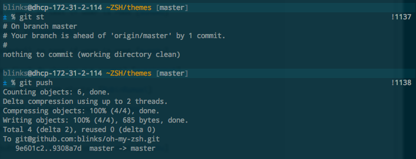
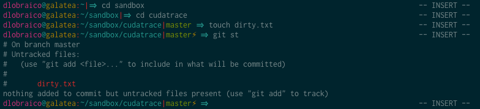
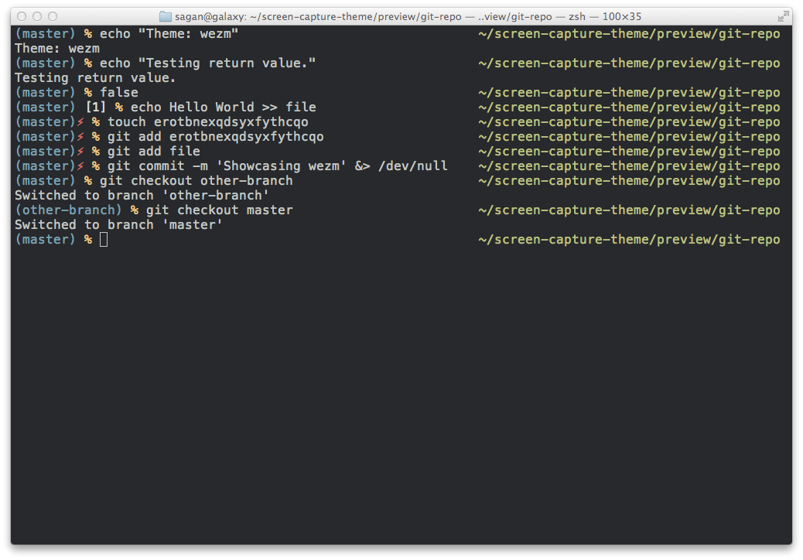

# Programas a serem instalados

+ *GIT* - Git é um sistema de controle de versões distribuído, usado principalmente no desenvolvimento de software, mas pode ser usado para registrar o histórico de edições de qualquer tipo de arquivo.

+ *ATOM* - Atom é um editor de texto de código aberto disponível para as plataformas Linux, macOS e Microsoft Windows, desenvolvido pelo GitHub sob a licença MIT.

+ *ZSH* - O shell Z é um shell Unix que pode ser usado como um shell de login interativo e como um interpretador de comandos para scripts de shell.

+ *CURL* - É um comando disponível na maioria dos sistemas baseado em Unix. Ele é usado como abreviação para “Client URL”. Comandos Curl são destinados para funcionar como uma forma de verificar a conectividade da URL, além de ser uma ótima ferramenta de transferência de dados.

+ *DOCKER* (Node.js,Angular.js,PHP,PostgreSql,) - Docker é uma tecnologia de software que fornece contêineres, promovido pela empresa Docker, Inc. O Docker fornece uma camada adicional de abstração e automação de virtualização de nível de sistema operacional no Windows e no Linux.

+ *GIMP* - GIMP é um programa de código aberto voltado principalmente para criação e edição de imagens raster, e em menor escala também para desenho vetorial.

+ *VLC* - VLC media player é um reprodutor/tocador e transmissor multimídia de código aberto.

+ *GOOGLE CHROME* - O Google Chrome é um navegador de internet, desenvolvido pela companhia Google com visual minimalista.

+ *LIBRE OFFICE* - LibreOffice é uma suíte de aplicativos livre para escritório disponível para Windows, Unix, Solaris, Linux e Mac OS X.

+ *SNAP* - Snappy é um software de implantação e um sistema de gerenciamento de pacotes originalmente projetado e construído pela Canonical para o sistema operacional Ubuntu phone.

+ *VSCODE* - O Visual Studio Code é um editor de código-fonte desenvolvido pela Microsoft para Windows, Linux e macOS.

+ TRAMISSION

+ PHP -

## Processos obrigatórios

```sh
sudo apt update && sudo apt upgrade
sudo apt install mint-meta-codecs
```


### Programas que necessitam de configuração

>GIT

```sh
sudo apt-get install git
```

>ATOM

```sh
sudo add-apt-repository ppa:LeonardoCostaSabino/atom
sudo apt-get update
sudo apt-get install atom
```


>ZSH

```sh
sh -c "$(curl -fsSL https://raw.github.com/robbyrussell/oh-my-zsh/master/tools/install.sh)" #instalar
git clone https://github.com/zsh-users/zsh-autosuggestions ~/.zsh/zsh-autosuggestions
git clone https://github.com/zsh-users/zsh-syntax-highlighting.git
atom ~/.zshrc
#plugins=(git zsh-autosuggestions zsh-syntax-highlighting)
#(composer,copyfile,dirhistory,django,docker,extract,git,ng,node,npm,python,sudo)
#ZSH_THEME="blinks" (agnoster ou blinks ou pygmalion ou wezm)
```

>DOCKER

```sh
sudo apt-get update
sudo apt-get -y install apt-transport-https ca-certificates curl software-properties-common
curl -fsSL https://download.docker.com/linux/ubuntu/gpg | sudo apt-key add -
sudo add-apt-repository "deb [arch=amd64] https://download.docker.com/linux/ubuntu $(. /etc/os-release; echo "$UBUNTU_CODENAME") stable"
cat /etc/apt/sources.list.d/additional-repositories.list
deb [arch=amd64] https://download.docker.com/linux/ubuntu bionic stable
sudo apt-get update
sudo apt-get -y  install docker-ce docker-compose
sudo usermod -aG docker $USER
```

>GIMP

```sh
sudo add-apt-repository ppa:otto-kesselgulasch/gimp
sudo apt-get update
sudo apt-get install -y gimp
```

>VLC

```sh
sudo apt-get install vlc
```

>GOOGLE CHOROME

```sh
wget https://dl.google.com/linux/direct/google-chrome-stable_current_amd64.deb
sudo gdebi google-chrome-stable_current_amd64.deb
```

>SNAP

```sh
sudo snap install --classic code
```

>VSCODE

```sh
curl https://packages.microsoft.com/keys/microsoft.asc | gpg --dearmor > microsoft.gpg
sudo install -o root -g root -m 644 microsoft.gpg /etc/apt/trusted.gpg.d/
sudo sh -c 'echo "deb [arch=amd64] https://packages.microsoft.com/repos/vscode stable main" > /etc/apt/sources.list.d/vscode.list'
sudo apt-get install apt-transport-https
sudo apt-get update
sudo apt-get install code # or code-insiders
```

## Observações

>Themes of ZSH

+ Agnoster Theme


+ Blinks Theme



+ Pygmalion Theme



+ Wezm Theme


