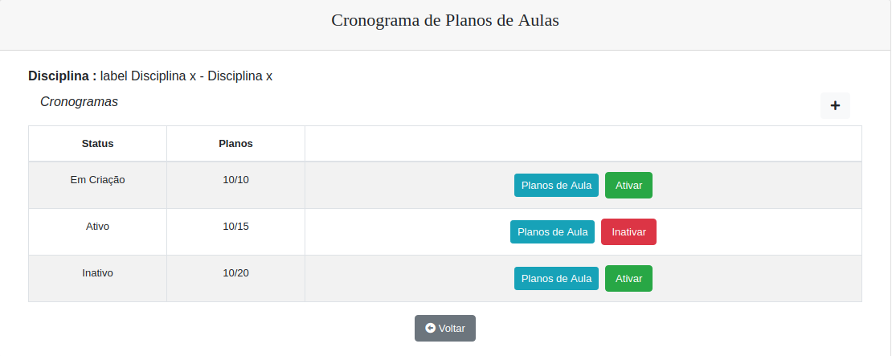
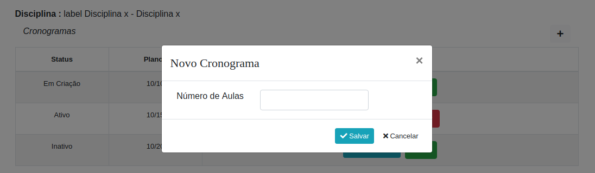
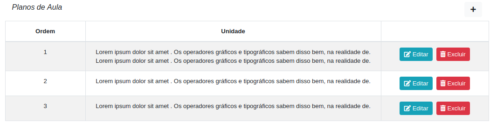
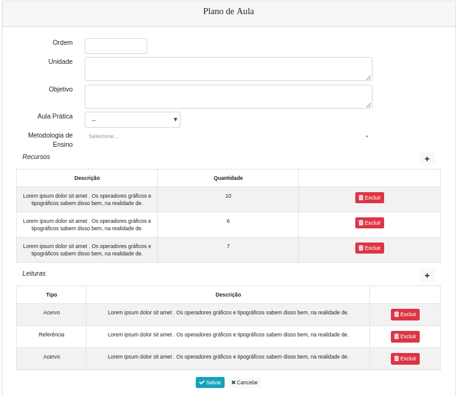

# Projeto Cronogramas de Aulas Sprint

### Colaboradores envolvidos

> + Pessoa1 (*Cargo*)

### Objetivo

>Padronizar o conteúdeo das aulas e facilitar o registro pelos professores.

### O Projeto é constituído por três miniprojetos

+ Cadastro de Cronogramas de aulas
+ Visualização dos Alunos dentro do ambiente
+ Utilização dos cronogramas pelos professores

### Cronogramas das aulas

As disciplinas passam a possuir conjuntos de planos de aulas.

Cada conjunto possuirá a quantidade de número de planos que deve possuir para que esse possa ser utilizado pelos professores.

>>>**Em cada conjunto estará descrito a quantidade de planos para que seja utilizado pelos professores -Versão Leo**

>>>**Em cada conjunto estará descrito o número de planos que deve possuir para que seja utilizado pelos professores -Versão Leo**

O controle de status será utilizado para administrar o conjunto de planos de aulas que poderão ser aplicados pelos professores em sala de aula.

Ao ser criado um conjunto novo, este é iniciado com status "**Em Criação**" e somente poderá se tornar "**Ativo**" quando forem registrados a mesma quantidade de planos de aula.

>>>Ao ser criado um cronograma entrará com status inicial de "**Em Criação**" e somente poderá ser alterado para "**Ativo**" quando o número de planos de aula registrados atingir a quantidade definida nesse conjunto. Versão Leo

Em cada disciplana somente poderá ter um conjunto ativo por vez, deste modo, ao se ativar um conjunto novo, o conjunto que estava ativo sera inativado automaticamente.

### Planos de aulas

Cada conjunto posuirá planos de aulas que deverão ser registrados na ordem que serão utilizados em sala de aula.

Os planos de aulas somente poderão ser alterados durante a fase em que o conjunto estiver "**Em Criação**".

O plano de cada aula poderá possuir vínculo com acervos da bibliotaca e com uma determinada aula prática (*Laboratórios*).

### Ambiente do professor

Sua tela inicial permitirá escolher o cronograma o que melhor agrada para ser seguido durante o semestre, sempre buscando atender todas as demandas de cada disciplinas.
